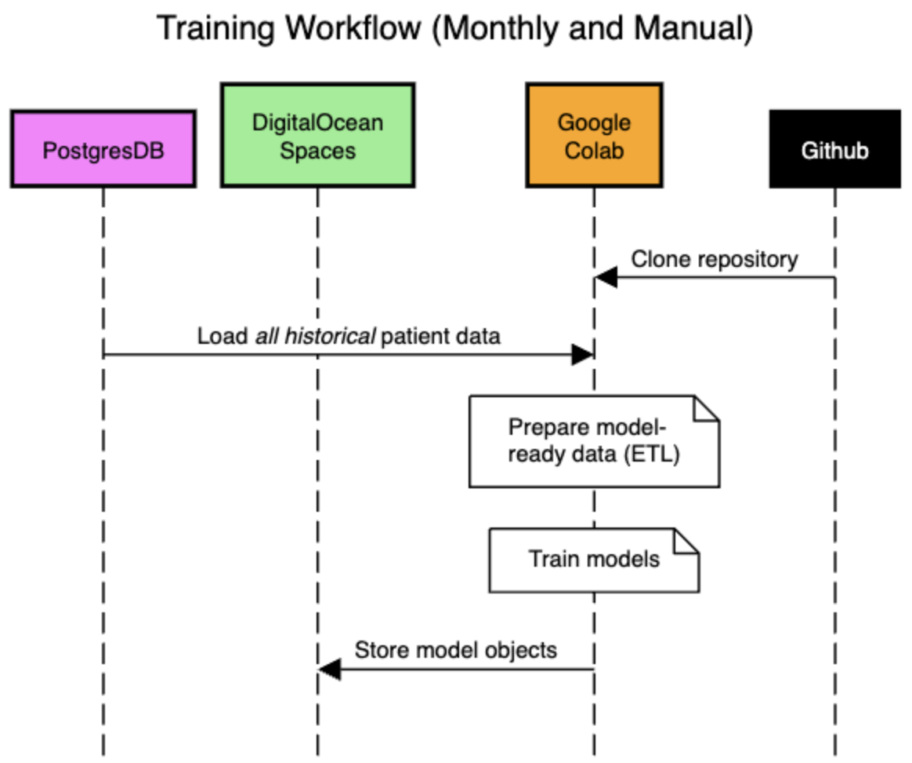
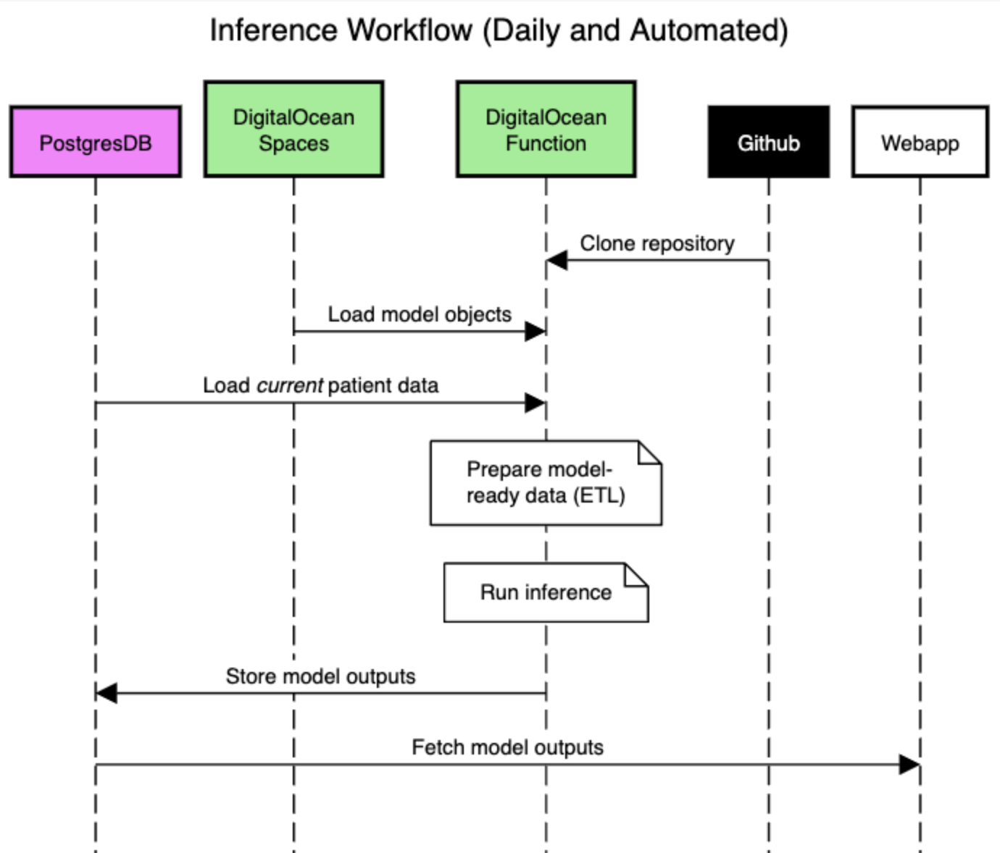

# ETL and Inference Code for Predictive Models of Health Outcomes

Authors:
- Brianna Eales
- Brian Chaplin
- Hunter Merrill

## Description

This codebase contains functionality for extracting, transforming, and loading (ETL) patient data to prepare it as input for downstream predictive models of patient outcomes, as well as running inference on this data using those models. DigitalOcean's [Functions](https://docs.digitalocean.com/products/functions/) are used to schedule ETL and inference jobs.

## Files and Structure
- `project.yml`: The configuration file defining how DigitalOcean Functions will run the code in this repo.
- `packages`: DO Functions require a top-level directory named "packages".
  - `packages/inference`: ETL scripts for preparing inference data and scripts for running inference on the prepared data.
    - `packages/inference/run/run.py`: This is the entry point and contains the `main` function that DO will invoke.
    - `packages/inference/run/etl.py`: Contains functions that load cleaned data from Postgres and returns weekly dataframes.
    - `packages/inference/run/etl_deterioration.py`: Contains functions that take in weekly dataframes and return time series.
    - `packages/inference/run/util.py`: Contains utility functions used throughout.
- `.github/workflows/main.yml`: Configuration file that automates deployment and scheduling when a PR is merged to main.

The full directory structure is shown below. The `hello` directory contains code I was using to test DO Functions, and the `to_archive` directory contains the raw R&D code that was used to develop these models.
```
├── .github
│   └── workflows
│       └── main.yml
├── README.md
├── project.yml
├── packages
│   └── inference
│       ├── run
│       │   ├── etl_deterioration.py
│       │   ├── etl.py
│       │   ├── run.py
│       │   └── util.py
│       └── hello
│           └── hello.py
└── to_archive
    ├── data-update.R
    ├── etl_deterioration.ipynb
    └── etl.ipynb
```

## Schematic Diagrams




## Cost

DigitalOcean Functions pricing is described [here](https://www.digitalocean.com/pricing/functions#pricing). In short, the cost is RAM (GiB) times runtime (seconds), minus a 90k GiB $\cdot$ seconds allowance per month, times $0.0000185. I don't know yet how long the code runs or how much RAM it uses, but the table below shows some expected cost based on some assumptions.

| Runs per month | Assumed RAM used | Assumed runtime | **Cost per month** |
| -------------: | ---------------: | --------------: | -----------------: |
|             30 |              1GB |          30 min |          **$0.00** |
|             30 |              8GB |          15 min |          **$2.31** |
|             30 |              4GB |          30 min |          **$2.31** |
|             30 |              8GB |          30 min |          **$6.33** |
|             30 |             16GB |          1 hour |         **$30.30** |

## Potential Issues

DigitalOcean Functions do not have an R runtime.

## Next Steps

- Ensure the ETL Function can authenticate to and access the Taimaka Postgres database

## For Developers

### Description

This repo is modeled after DigitalOcean's [Functions Quick Start](https://docs.digitalocean.com/products/functions/getting-started/quickstart/) page. A Function is a block of code that runs on demand without the need to manage any infrastructure (i.e., it is "serverless"). I chose to use Functions because they are serverless and can be scheduled.

Deployment is automated with Github Actions [here](.github/workflows/main.yml). The process in that file can also be emulated locally (though is not required). I'll describe each step below.

### Installing `doctl`

On mac, install `doctl`:
```bash
brew install doctl
```

Other OS's require other methods to install.

In the DigitalOcean console in the browser, retrieve an API token (or create one if one is not available), then run the following code in your terminal to authenticate your local machine to your DigitalOcean account:
```bash
doctl auth init  # set up a base context. I pasted my token when prompted.

# You can have more than one DO context:
doctl auth init --context taimaka

# switch contexts from default to taimaka
doctl auth switch --context taimaka
```

Now install serverless functions:
```bash
doctl serverless install
```

There are more details on installation and troubleshooting on DigitalOcean's [installation page](https://docs.digitalocean.com/reference/doctl/how-to/install/).

### Setup and deployment

Here is the only step that needed to be run manually once. I created a namespace within the Taimaka DO environment for our serverless function:
```bash
doctl serverless namespaces create --label taimaka-health-predictions --region lon1
```

And I deployed the "hello, world" function in this repo to that namespace:
```bash
# run this from the root directory that contains `project.yml`:
doctl serverless deploy .
```

You will get output that looks similar to this (which I edited to remove the UUIDs identifying the namespace and host):
```
Deploying '/Users/hunter.merrill/dev/repos/health-predictions'
  to namespace '<uuid redacted>'
  on host 'https://<host redacted>.doserverless.co'
Deployment status recorded in '.deployed'

Deployed functions ('doctl sls fn get <funcName> --url' for URL):
  - inference/hello
Deployed triggers:
  - trigger-etl-every-day
```

In the DigitalOcean dashboard in the browser, you can see that the `inference/hello` function was indeed scheduled to run every day. Since these are just for testing and I don't want to waste resources, I undeploy:
```bash
doctl serverless undeploy inference/hello
```